# Deploying the Application 

By the end of this tutorial you will learn how to package and deploy this application which allows the user to Process, Classify, and Segment medical images. 

In order to deploy the anomaly detection demo, 

  1. Go to the [OpenShift Console](https://console-openshift-console.apps.rhods-internal.61tk.p1.openshiftapps.com/) and log in with your credentials. This environment is availabe to any Red Hat employee who wants to use RHODS for their Data Science needs.

  2. Once you sign in, switch your view from Developer -> Administratior (located at the top of the sidebar). The Administrator view allows you to see every component of the cluster.

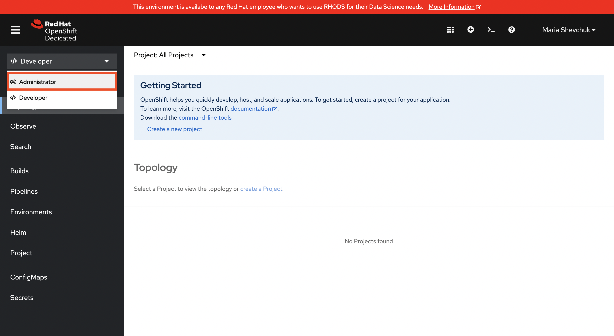

  3. Go to the "Projects" page and click the "Create Project" button in the top right corner.

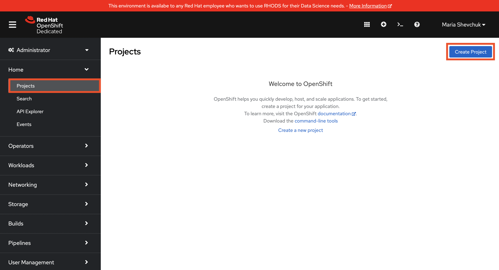

  4. You will now need to create a project name, display name, and brief description of your project. Make sure that your project and display name do not contain any upper case letters and your project name does not contain any spaces. It is also good practice to keep your project and display names consistent, removing any hyphens or underscores in the latter, eg: 
  
     Name: name-monai-demo
  
     Display name: test  name monai demo
     
 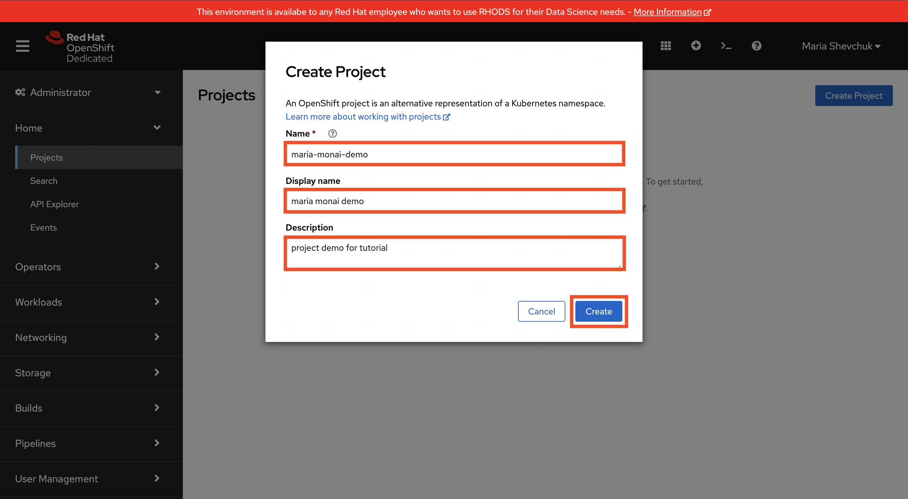
     
  
  5. Once you are done creating your project, switch back to the Developer view, where we will containerize the source code from GitHub. 

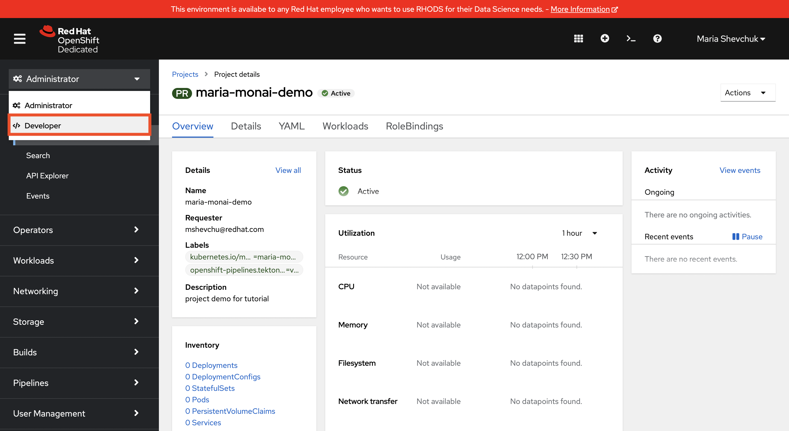

  6. Once in the developer view, check that the correct project is selected from the dropdown menu at the top of the page. Then, head to the "+Add" page.

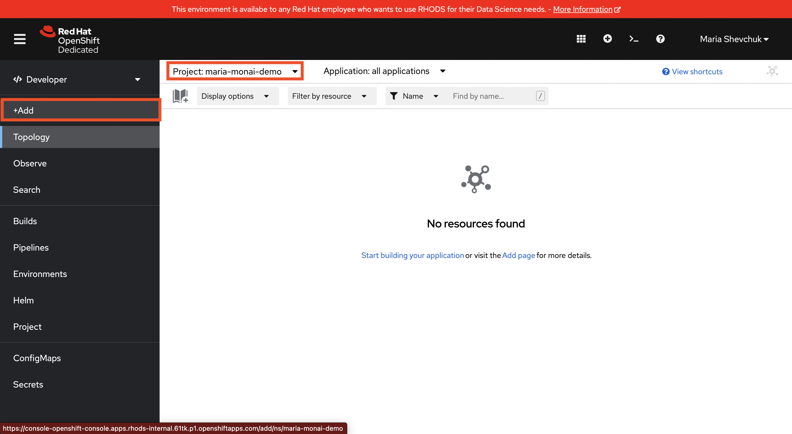

  7. Locate the "Git Repository" section and click "Import from Git". 

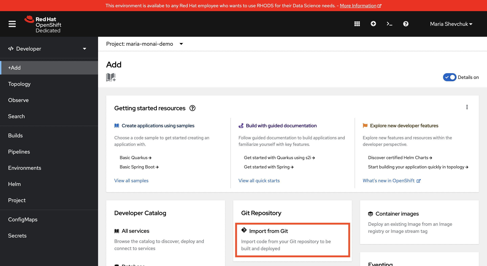

  8. You will now need to provide the [GitHub URL](https://github.com/rh-aiservices-bu/rhods_monai.git) that contains the source code. 
  
    URL: https://github.com/rh-aiservices-bu/rhods_monai.git
  
  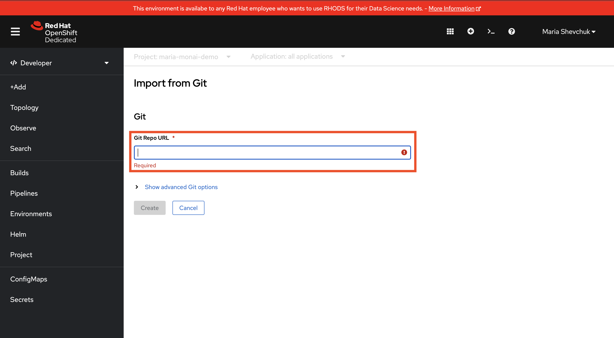
  
  9. Once the Builder Image has been detected, you should see that Dockerfile has been automatically selected as the import strategy.

  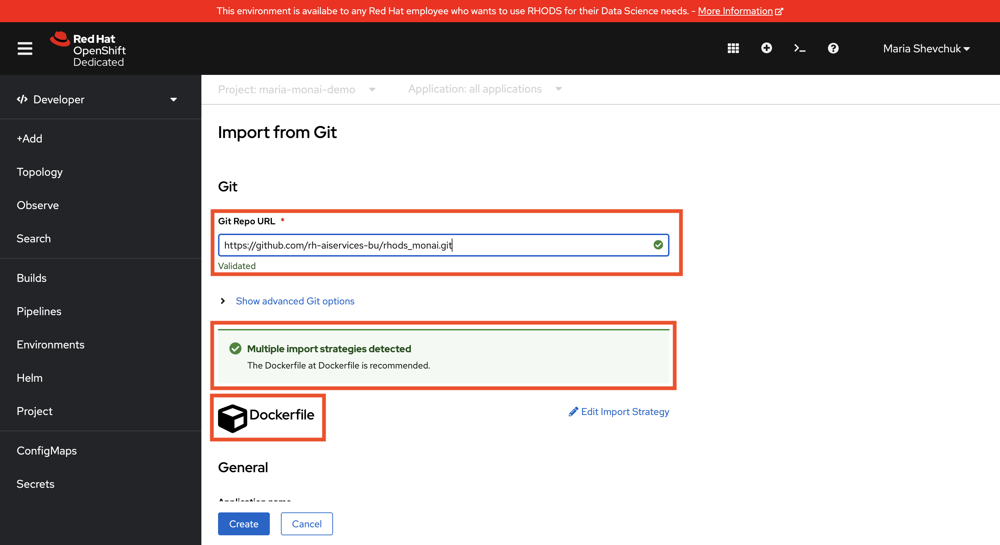

  10. Scroll down and take note of the Application name. Make sure that the "Deployment" option is selected under "Resources". Under "Advanced options" leave the Target port at the default 8080 and make sure that the "Create a route to the Application" box is checked - this will create a public URL to your application. Once you ensure that all settings are correct, click "Create". 

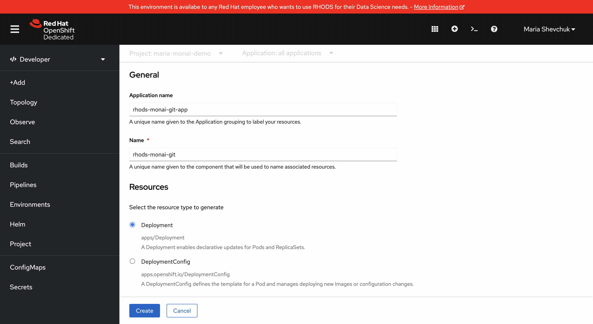

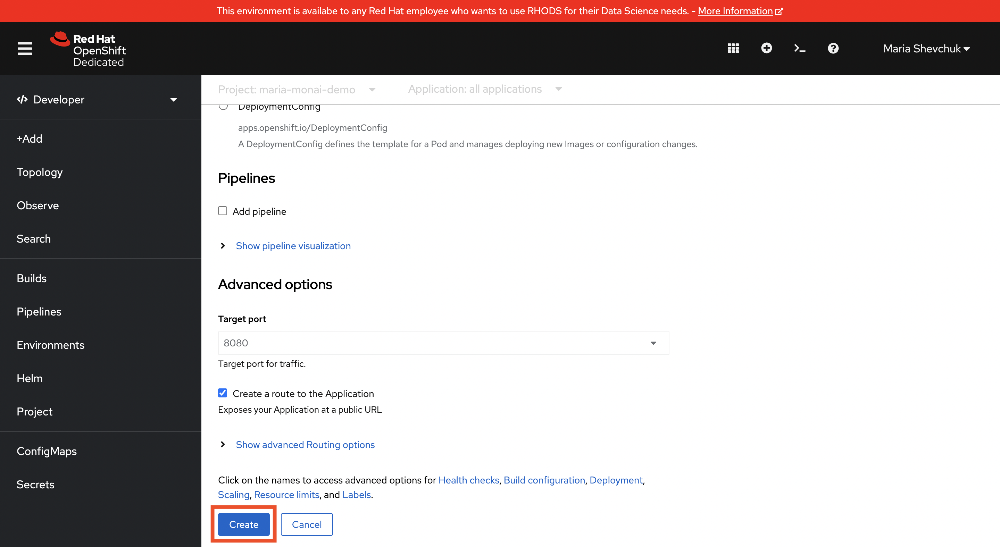

  11. Since our application requires a GPU for certain tasks, we will need to edit the code in our deployment method to ensure that our application is deployed on a node that has a GPU. Locate the "Actions" dropdown menu and select "Edit Deployment" 

     Note: Skip steps 11 through 14 if you do not have access to a GPU (or if you are unsure). 
     
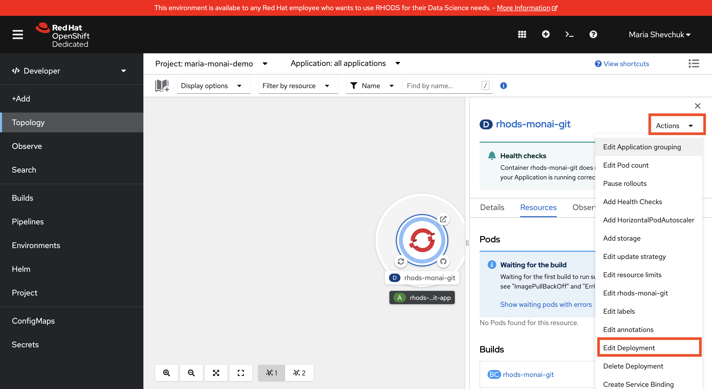

  12. Switch the view from "Form view" to "YAML view". 

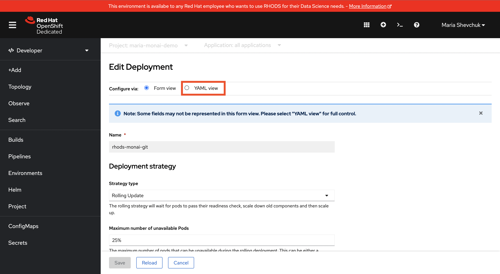

  13. In the YAML file, locate "resources" object (line 129), it should be empty. 

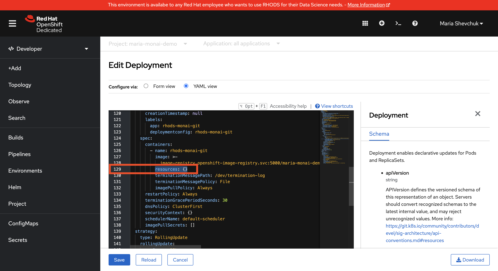

  14. To request a GPU, add the following code: 

    resources: 
      requests: 
        nvidia.com/gpu: '1'
       limits: 
        nvidia.com/gpu: '1'
        
  Refer to the image below to check and click "Save". 
  
  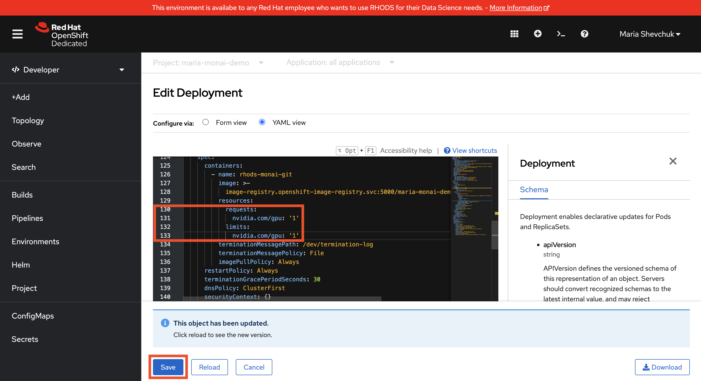
  
  15. Once the build is complete, go back to the "Topology" page. You now have access to the URL for your Application.

  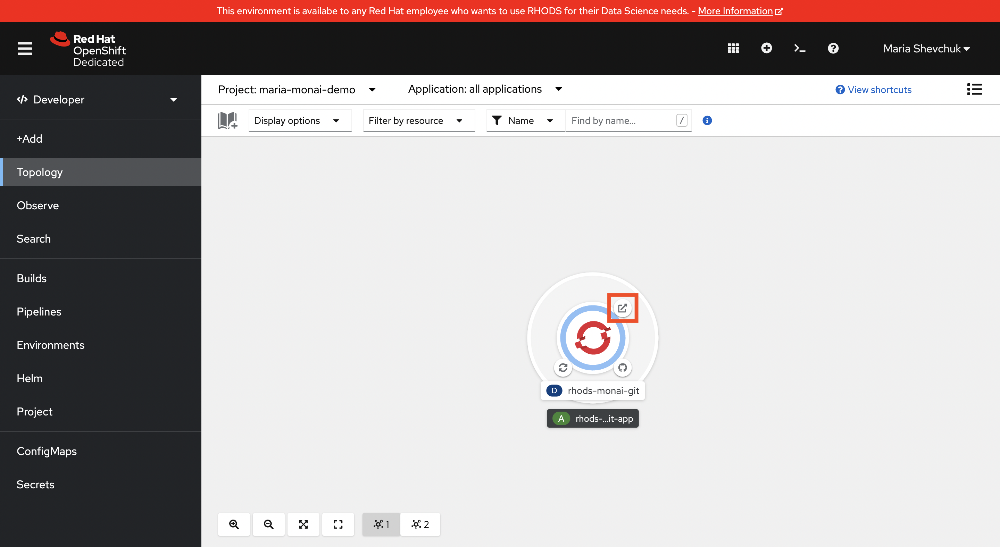

  
