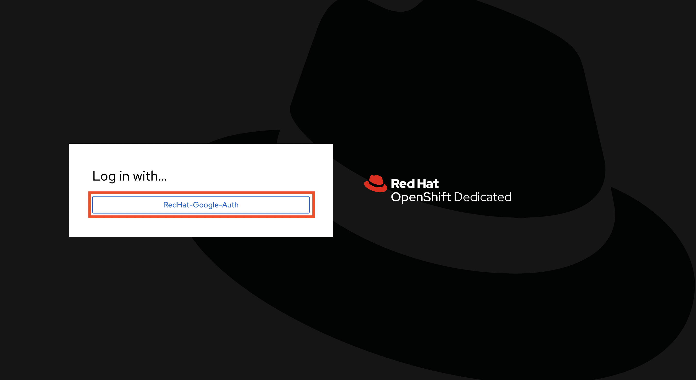
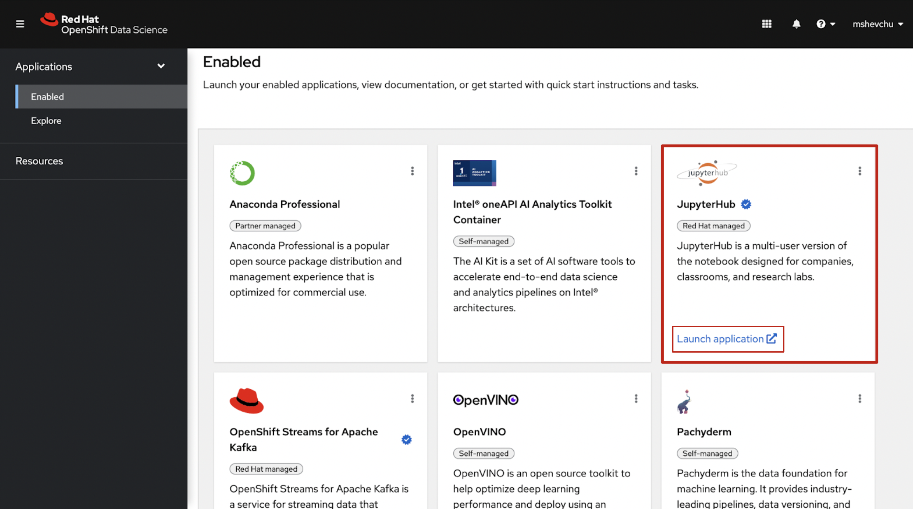
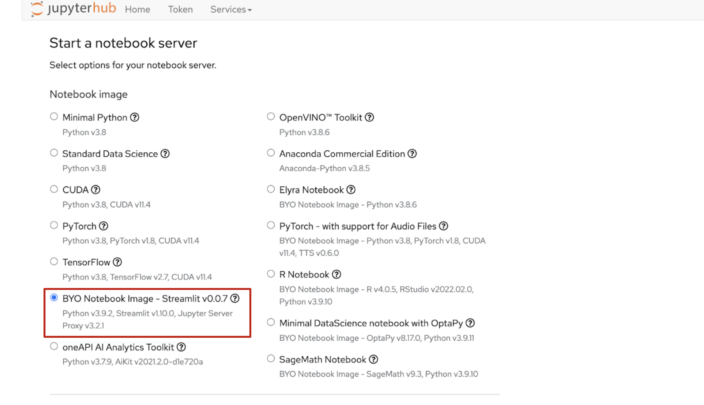
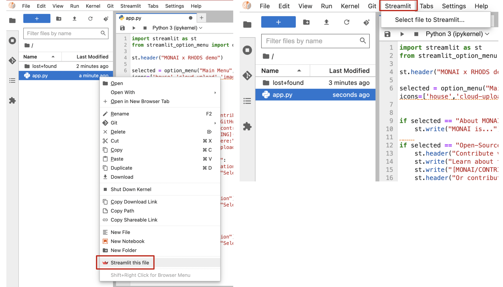

# Streamlit Add-On

In this tutorial you will learn how to use the Streamlit Add-On within the RHODS environment. 

In order to access the Add-On, 

  1. Go to the [OpenShift Data Science dashboard](https://rhods-dashboard-redhat-ods-applications.apps.rhods-internal.61tk.p1.openshiftapps.com/) and log in with your credentials. This environment is availabe to any Red Hat employee who wants to use RHODS for their Data Science needs.

  2. After the OpenShift Data Science dashboard launches, it displays all currently enabled applications. Locate JupyterHub and click "Launch Application". 

  3. You will be prompted to select an option for your notebook server. Select any notebook that specifies that it includes streamlit (usually BYO Notebook image) or your own custom image.

  4. Once you're in the Jupyter environment, select the desired .py file to streamlit and either 1. right-click on the file and select the "Streamlit" button or 2. click the "Streamlit" button on the top bar menu and select a file to streamlit. 

  Note: The file you want to Streamlit must be a python file (cannot be a notebook file). 
  
  
